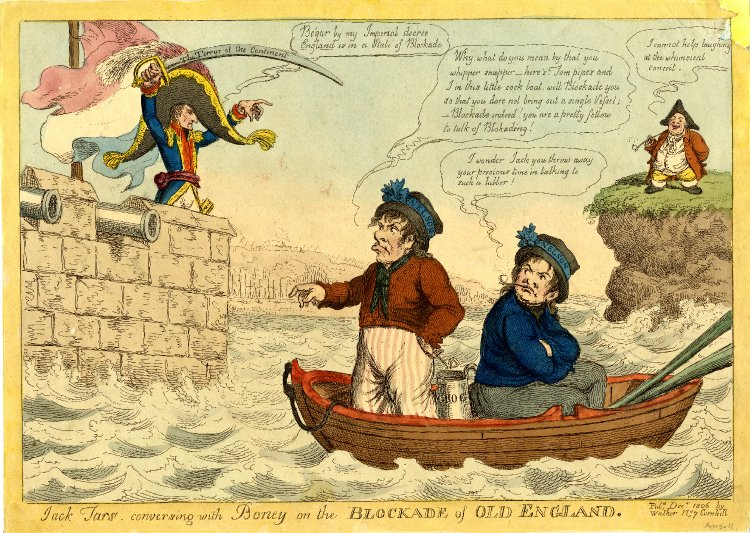
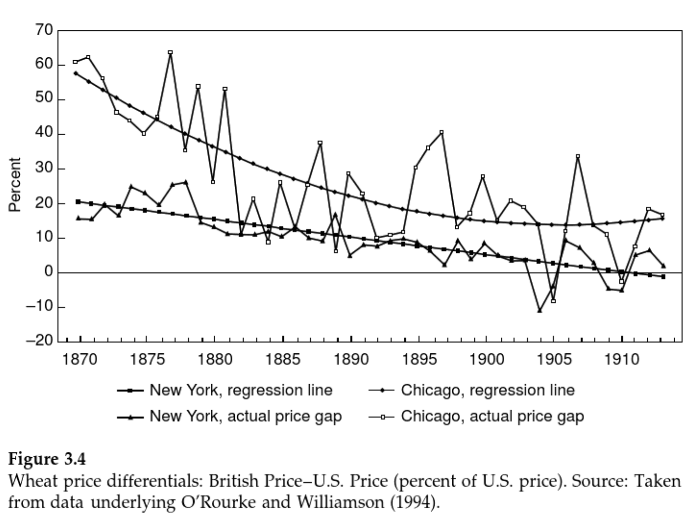
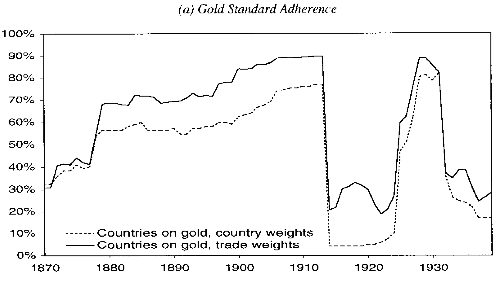
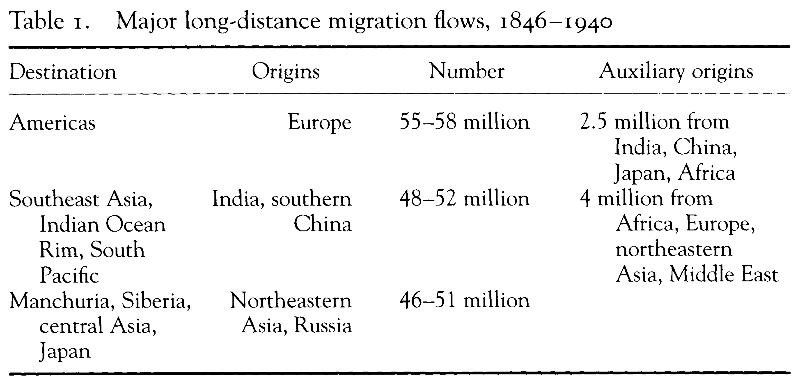
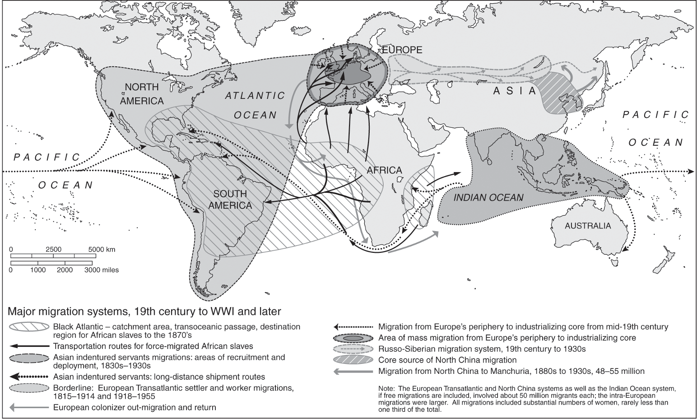
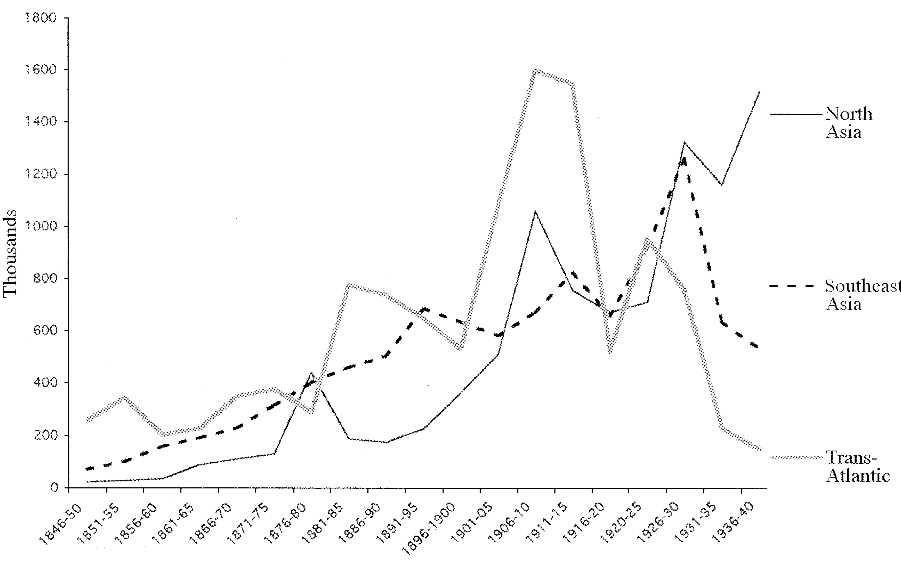
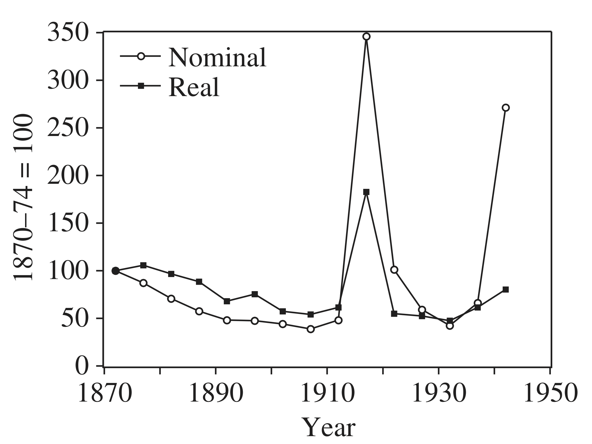
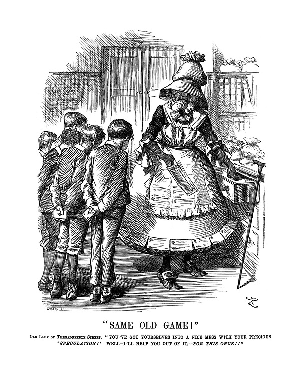
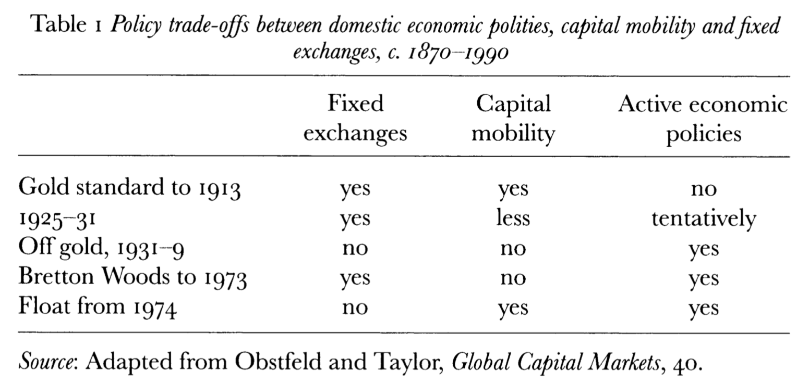

```{r setup, include=FALSE}
knitr::opts_chunk$set(echo = FALSE, warning = FALSE,
                      message = FALSE, fig.align='center', fig.retina=3,
                      out.width="75%")


```

```{r xaringan-themer, include = FALSE}
library(xaringanthemer)
style_solarized_light()
source("helper_functions/theme_lecture.R")
xaringanExtra::use_webcam()
xaringanExtra::use_tile_view()
```


# Today's Talk

.pull-left60[

### 1. The geopolitical settlement:
  - Britain at the end of the French Wars

### 3. The Consequences of Globalization
  - Whether globalization generates instability
  - Globalization and WWI
]

.pull-right40[

### 2. Global economic integration
  - The mass movement of goods
  - The mass movement of capital
  - The mass movement of people
]

---

class: inverse, center, middle

# Part I

---

## The shift: From  **Mercantilism** to **Free trade**

> "The prevailing mercantilist doctrine [of the 18th c.] ...viewed the struggle for wealth as a zero-sum game, and each of the powers looked upon its colonies as suppliers of raw materials and markets for manufactures of the 'mother country' alone, with foreign interlopers to be excluded by force if necessary. ...The aim was to exert monopoly control over a given trade, thus gaining monopoly profits, which in turn would increase the state's ability to successfully wage war, thus enhancing its mercantilist trade objectives."<br> -Findlay & O'Rourke, p. 228.


### Key factors in the emergence of a new 19th c. economic order

.large[
1. The industrial revolution
2. The defeat of Napoleon
3. The loss of colonies in the Americas
]

---

.pull-left[
## The Industrial Revolution in Global Context

+ Applications of industrial technology reduce transport costs
+ Industrial technology heightens global inequalities of wealth/power
+ Industrial revolution reverses long-standing European-Asian trading pattern
    - Europe finally runs trade surpluses
    - Asian manufactures (e.g. Indian textiles) face growing competition
    - Terms-of-trade swing towards primary products prompting Asian de-industrialization (Austin, 302).

]

.pull-right[

]

---

### The Defeat of Napoleon

.pull-left60[

.footerb[
Charles Minard, *Carte figurative des pertes successives en hommes de l'Armée Française dans la campagne de Russie 1812–1813*, 1869
]
]

.pull-right40[
+ Invasion of Russia key to defeat (Schroeder, 1994)
    + Disastrous loss of life
+ Weakening of Napoleon prompt's Prussian defection
+ Napoleonic intransigence scuttles Franco-Russian settlement mediated by Austria
+ Britain's role is mostly financing
]


---

## The Post-War Settlement: British Semi-Hegemony?

> Each of the two flanking powers commanded more intrinsic resources than any of the other three. ...Britain dominated the seas while leading the world in industry, commerce, colonies, and financial power ... each of these flanking powers enjoyed virtual impregnability by virtue of geography... Thus Britain and Russia were so powerful and invulnerable that even a (highly unlikely) alliance of the three other powers against them would not seriously threaten the basic security of either, while such a (hypothetical) alliance would likewise not give France, Austria, and Prussia security comparable to that which Britain or Russia enjoyed on their own. <br> -Schroeder, "Did the Vienna Settlement Rest on a Balance of Power?", p. 688

### Britain emerges as...

+ Strongest industrial power
    + Least economically crippled by war
+ Largest Navy by order of magnitude
+ Not directly threatened by only other large power (Russia)

---

```{r, naval_sup, fig.align='center', out.width='90%', fig.height=4, fig.width=6, fig.retina=4}
library(tidyverse)
library(ggrepel)
library(ggthemes)

nav_sup <- data.frame(year = rep(c(1805, 
                               1810,
                               1815,
                               1820,
                               1825,
                               1830), 9),
                      fleet = rep(c("Great Britain",
                                "France",
                                "Netherlands",
                                "Spain",
                                "Sweden",
                                "Denmark/Norway",
                                "Russia (Baltic)",
                                "Russia (Black Sea)",
                                "USA"), each=6),
                      ships = c(329, 398, 350, 
                                248, 221, 217,
                                87, 84, 92, 
                                86, 89, 102,
                                26, 23, 36,
                                28, 32, 40,
                                74, 50, 33,
                                33, 18, 10,
                                22, 21, 20, 
                                18, 13, 13,
                                37, 34, 2,
                                5, 10, 13,
                                46, 46, 49, 
                                43, 52, 53,
                                18, 14, 25,
                                24, 22, 26,
                                12, 12, 16,
                                20, 22, 32))


nav_sup %>% 
  ggplot(aes(year, ships, group = fleet, color = fleet)) + 
  geom_line() +
  geom_point(size = 3) + 
  geom_text_repel(data = nav_sup %>% filter(year == 1830), 
                   aes(year, ships, label=fleet), 
                  nudge_x = 7, segment.colour = "black", segment.alpha = .5
                  ) +
  theme_lecture + 
  guides(color=FALSE) +
  xlim(c(1805, 1840)) +
  scale_color_hc() +
  xlab("") + ylab("# of Ships (log scale)") +
  #scale_y_log10() +
  ggtitle("The Naval Balance of Power",
          subtitle = "Source: Harding (1999), Appendix")
```

---

## The Napoleonic War and Trade

.pull-left40[


+ The Continental Blockade
    - Napoleon tries to starve Britain of gold by feeding them (1810)!
    - Logic: deny opponent precious metals
    - 'Blockade' somewhat illusory
+ Britain 'Orders in Council' 1807
    - Neutral ships carrying enemy colonial goods must ship to British ports first
]

.pull-right60[

]

---

### Short-Run Effects of the Napoleonic War

```{r relative_prices, fig.align='center', out.width='70%', fig.height=4, fig.width=6, fig.retina=4}

library(ggalt)

rpd <- data.frame(rp = rep(c("Wheat/Textiles", "Textiles/Wheat", 
                         "Textiles/Wheat"), each = 2),
                  Country = rep(c("Britain", "France", "Prussia"),
                                each = 2),
                  Period = rep(c("War", "Blockade"), 3),
                  Ratio = c(19.03, 41.35, 16.58, 19.84,
                            6.74, 5.71))

rpd %>% 
  ggplot(aes(rp, Ratio, fill = Period, 
             label = paste0(Ratio, "%"))) +
  facet_wrap(~Country, scales = "free_x") +
  geom_col(position = "dodge") +
  geom_text(position = position_dodge(width = 1), vjust = -.8) +
  ylim(c(0, 45)) +
  xlab("") +
  theme_lecture + 
  scale_fill_hc()

```

.footerb[
Source: Findlay & O'Rourke, Table 7.1
]

---

class: inverse, center, middle

# Part II

---

### The Movement of Goods

.center[
]

---

.right-column[
```{r merchant_shipping, fig.align='center', out.width='90%', fig.height=4, fig.width=6, fig.retina=4}

mshipping <- tibble(Date = c(1814, 1860, 1890, 1914),
                    Tonnage = c(2.3, 5.7, 10, 20))

mshipping %>% 
  ggplot(aes(Date, Tonnage, label = Tonnage)) + 
  geom_lollipop(point.size = 5, point.colour = "tomato") +
  geom_text(nudge_y = 1.5) +
  ylab("Tons (Millions)") +
  xlab("") +
  theme_lecture +
  scale_x_continuous(breaks = mshipping$Date) +
  ggtitle("British Merchant Fleet Tonnage")

```

.footerb[
Source: Belich, p. 111
]
]

.left-column[
"The British merchant fleet... amounted to 40 to 50 per cent of the world's total shipping and an even larger share of its ocean-going steam shipping ...as high as 71 per cent in 1900." <br> -Belich, p. 111.

]

---

```{r trade_growth, fig.align='center', fig.retina=4, out.width='90%', fig.height=4, fig.width=6}
library(tidyverse)
library(ggthemes)
library(ggrepel)

df <- tibble(date = c(1700, 1760, 1780, 1801, 1831, 1851),
                 `Share of GDP` = c(8.4, 14.6, 9.4, 15.7, 14.3, 19.6),
                 `Share of Manufacturing` = c(13, 18, 25,40,49,NA))

df %>% gather("indicator", "share", -date) %>% 
  ggplot(aes(date, share, 
             color = indicator, 
             label = paste0(share, "%"))) +
  geom_point(size = 3) + 
  geom_line()+
  geom_label_repel(color = "black") +
  ggtitle("Trade is Important to British prosperity", subtitle = "Particularly in Manufacturing") +
  theme_hc() +
  scale_color_hc() +
  theme_lecture +
  ylab("Share (%)") +
  xlab("")

```

---

## The export of capital

.pull-left40[

+ Britain, the USA, and Germany all save ~11-15% of GNP in 1870-1914
    - The USA and Germany invest ~90% domestically
    - Britain invests ~40% abroad
+ Arguably largest share of investment flowing abroad ever recorded (Pollard, "Capital Exports", p. 491)
+ Dwarfs the overseas investments of most other countries at the time
]

.pull-right60[

```{r british_inv, fig.align='center', fig.retina=4, out.width='90%', fig.height=5, fig.width=6}

inv_df <- tibble(Date = as.factor(rep(c(1870, 1900, 1914), 4)),
                 Country = rep(c("Britain", "France", 
                             "Germany", "United States"), each=3),
                 Amount = c(4900, 12000, 20000,
                            2500, 5800, 9050,
                            NA, 4800, 5800, 
                            100, 500, 3500))

inv_df %>% 
  ggplot(aes(Date, Amount, fill = Country)) +
  geom_col(position = "dodge") + 
  theme_lecture +
  scale_fill_hc() +
  ylab("overseas Investment (Millions of $)") +
  xlab("") + 
  ggtitle("The Scale of British Overseas Investment")

```
]

---

### Where did Britain put its money?

```{r market_weights, fig.retina=4, fig.height=4, fig.width=6}
library(tidyverse)
weights <- read_csv("michie_lse_weights.csv")

weights <- weights %>% mutate(Market_Weight = as.numeric(Market_Weight))

weights %>% 
  ggplot(aes(Security, Market_Weight, fill = Security,
             label = Market_Weight)) +
  facet_wrap(~Year, nrow = 1) +
  geom_col(position = "dodge") +
  geom_text(nudge_y = .075) +
  theme_lecture +
  scale_fill_hc() +
  xlab("") +
  ylab("Market Weight") +
  guides(fill = FALSE) +
  coord_flip() +
  theme(axis.text.x=element_text(angle=45, hjust=1)) +
  labs(caption = "Source: Chabot & Kurz, Table 6") 
```

---

## Capital flows and the gold standard

.pull-left[

]

.pull-right[
+ Across the 19th century countries increasingly adopted the gold standard
    - Preferred by investors to insulate against exchange rate shocks
    - Preferred by traders so they do not have to hedge currency risk
+ Gold standard is complicated: **not** just paying people with gold coins
    - notes redeemable for gold, notes redeemable for other notes that are redeemable for gold, etc.
    ]
---

## The Movement of People

.center[
]

---

## The extent of 19th c. global migration

.center[

]

---

### Multiple migration systems

.center[

]
+ We should not privilege Atlantic migration

---

## When were migration flows?

.center[

]

---

class: inverse, center, middle

# Part III

---

### Was there deglobalization?

#### Yes, in several dimensions

+ trade costs, market integration, migration flows, gold standard adherence, etc.

> "...the Liverpool–New Orleans cotton price gap increased from 12% to 43.8%; the London–Calcutta jute price gap rose from 4.4% to 106.8%, the rapeseed price gap rose from 14% to 140%, and the linseed price gap rose from 21.8% to 216.8%; the Hull–Bombay cottonseed price gap rose from 39.9% to 278%; and the London–Rangoon rice price gap increased from 26.5% to an astonishing 422.5%"<br>
-Findlay & O'Rourke, p. 434

.pull-left[
#### WWI ushers in

+ Significant *divergence* in global goods prices
+ Countries did **not** generally become more closed to trade during WWI...
    - But markets became less integrated
]
.pull-right.center[

]

---

## What accounts for the forces of deglobalization?

.large[ 
+ 3 hypotheses (James, *The End of Globalization*, 2001)
    - Speculative finance
    - Nationalist resentment of distributional consequences (pressure on wages, sectors)
    - Growth of national structures to cope with global forces

#### Does globalization necessarily generate dissatisfaction?

> "The history of the modern world economy illustrates two points. First, economies work best when they are open to the world. Second, **open economies work best when their governments address the sources of dissatisfaction with global capitalism.**" (Frieden, *Global Capitalism*, p. 476)
]

---

.pull-left[
### Speculative finance

+ Flow of global lending creates economic interdependencies in the 19th c.
+ A crisis in one country can propagate to others
+ Many examples, e.g. 1825 foreign loans crisis, 1873 panic in New York, or 1890s Baring crisis


> "To the extent that the Depression was caused by malfunctioning international capital markets, or the gold standard that was thought at the time to underpin them, we have **yet another case of globalization undermining itself, since the Depression was the major cause of interwar protectionism**" (O'Rourke 2019, 371-2).

]

.pull-right.center[

]

---

### The distributional consequences of globalization

+ The Trilemma
    + The 'inconsistent quartet' with trade 
    + Expanded to 'incompatible quintet' with migration/labor market 

.center[
]

---


> "The aim of this essay is to question this common sense view of World War I as disrupting the world economy and putting an end to an era of globalization. ...We offer a narrative sketch of how one might write **a history in which the war figured not as an exogenous shock**, but as a moment of convulsive and violent realignment endogenous to that history. ...what is at stake are **the destabilizing consequences of convergence**, the basic prediction of any neoclassical vision of globalization. ...Being converged upon by Imperial Russia was every bit as unsettling to the powers of Western Europe before 1914, as the rise of China is to the United States today."<br>
-Tooze & Fertik

### A cause of WWI?

> "...capital flows and technology transfer helped Russia converge on the established powers. This disrupted pre-existing geopolitical equilibria and led Germany in particular to devise military strategies to counter the threat. ...the spread of the Industrial Revolution to Germany had earlier undermined the geopolitical equilibrium in Europe.." (O'Rourke 2019, 373).