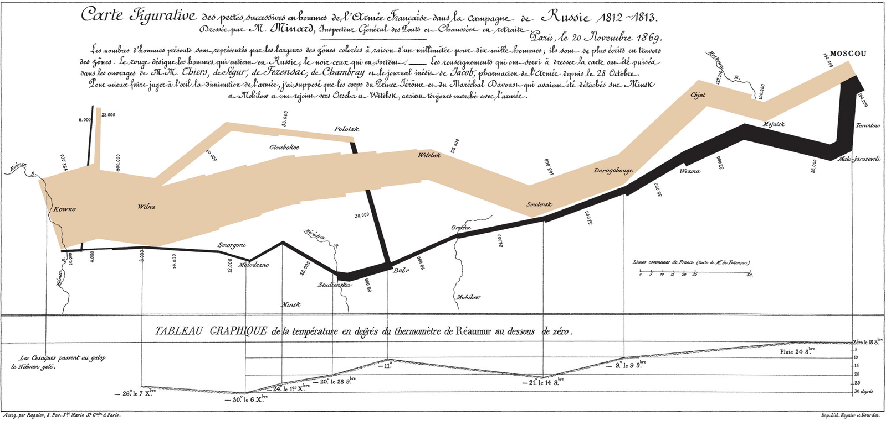

<style type="text/css">
.white { color: white; }
.large { font-size: 130% }
.small { font-size: 70% }
.pull-right40{ 
  float: right;
  width: 40%;}
.pull-left60{
  float: left;
  width: 60%;
}
.pull-left40{
  float: left;
  width: 40%;
}
.pull-right60{
 float: right;
 width: 60%;
}
.scale120{
  float: left;
  width: 120%;
}
.scale80{
  float: right;
  width: 80%
}
.footer{
    font-size: 10pt;
    color: #F7F8FA;
    position: absolute;
    left: 15px;
    bottom: 2px;
}
.footerb{
    font-size: 10pt;
    color: black;
    position: absolute;
    left: 15px;
    bottom: 2px;
}
.audio-placement{
    position: absolute;
    right: 15px;
    top: 2px;
}
.video-placement{
    position: absolute;
    right: 2px;
    bottom: 2px;
}
</style>

```{r setup, include=FALSE}
knitr::opts_chunk$set(echo = FALSE, message = FALSE, warning = FALSE)
```


```{r xaringan-themer, include = FALSE}
library(xaringanthemer)
solarized_light()
source("~/Dropbox/teaching/lecture_ggplot2_theme.R")
```

# Welcome to Online Teaching!

### To Navigate

+ Press `f` to enter fullscreen
+ Press `Down/Right` to move forward
+ Press `Up/Left` to move back

### Video/Audio

+ If in full-screen plays automatically when you switch slides
+ Can pause video by clicking on player

<video width="20%" height="15%" controls id="my_video">
    <source src="videos/1_intro.mp4" type="video/mp4">
</video>

---

background-image: url("atkinson_liverpool_quay.jpg")
backgroun-size: fit

.pull-left60[

# Today's Talk

.white[
+ The geopolitical settlement:
    - From Waterloo to Crimea
    - The expansion of empire
    - From Crimea to WWI
+ Global economic integration
    - The mass movement of goods
    - The mass movement of capital
    - The mass movement of people
+ The Consequences of Globalization
    - Spread of industrialization & the balance of power
]
]

.footer[
Atkinson Grimshaw, *Liverpool Quay by Midnight*, [Photo © Tate](https://www.tate.org.uk/art/artworks/grimshaw-liverpool-quay-by-moonlight-t00902)  
]

<video width="20%" height="15%" controls id="my_video">
    <source src="videos/2_overview.mp4" type="video/mp4">
</video>

---

## The shift: From  **Mercantilism** to **Free trade**

> "The prevailing mercantilist doctrine [of the 18th c.] ...viewed the struggle for wealth as a zero-sum game, and each of the powers looked upon its colonies as suppliers of raw materials and markets for manufactures of the 'mother country' alone, with foreign interlopers to be excluded by force if necessary. ...The aim was to exert monopoly control over a given trade, thus gaining monopoly profits, which in turn would increase the state's ability to successfully wage war, thus enhancing its mercantilist trade objectives."<br> -Findlay & O'Rourke, p. 228.


### Key factors in the emergence of a new 19th c. economic order

.large[
1. The industrial revolution
2. The defeat of Napoleon
3. The loss of colonies in the Americas
]

<video width="20%" height="15%" controls id="my_video">
    <source src="videos/3_shift.mp4" type="video/mp4">
</video>

---

.pull-left[
## The Industrial Revolution in Global Context

+ Applications of industrial technology reduce transport costs
+ Industrial technology heightens global inequalities of wealth/power
+ Industrial revolution reverses long-standing European-Asian trading pattern
    - Europe finally runs trade surpluses
    - Asian manufactures (e.g. Indian textiles) face growing competition
    - Terms-of-trade swing towards primary products prompting Asian de-industrialization (Austin, 302).

]

.pull-right[

]

<video width="20%" height="15%" controls id="my_video">
    <source src="videos/4_ir.mp4" type="video/mp4">
</video>

---

### The Defeat of Napoleon



+ Invasion of Russia key to defeat (Schroeder, 1994)
    + Disastrous loss of life
+ Weakening of Napoleon prompt's Prussian defection
+ Napoleonic intransigence scuttles Franco-Russian settlement mediated by Austria
+ Britain's role is mostly financing

.footerb[
Charles Minard, *Carte figurative des pertes successives en hommes de l'Armée Française dans la campagne de Russie 1812–1813*, 1869
]

<video width="20%" height="15%" controls id="my_video">
    <source src="videos/5_defeat.mp4" type="video/mp4">
</video>

---

## The Post-War Settlement: British Semi-Hegemony?

> Each of the two flanking powers commanded more intrinsic resources than any of the other three. ...Britain dominated the seas while leading the world in industry, commerce, colonies, and financial power ... each of these flanking powers enjoyed virtual impregnability by virtue of geography... Thus Britain and Russia were so powerful and invulnerable that even a (highly unlikely) alliance of the three other powers against them would not seriously threaten the basic security of either, while such a (hypothetical) alliance would likewise not give France, Austria, and Prussia security comparable to that which Britain or Russia enjoyed on their own. <br> -Schroeder, "Did the Vienna Settlement Rest on a Balance of Power?", p. 688

### Britain emerges as...

+ Strongest industrial power
    + Least economically crippled by war
+ Largest Navy by order of magnitude
+ Not directly threatened by only other large power (Russia)

<video width="20%" height="15%" controls id="my_video">
    <source src="videos/6_balance_sheet.mp4" type="video/mp4">
</video>

---

```{r, naval_sup, fig.align='center', out.width='100%', fig.height=4, fig.width=6, fig.retina=4}
library(tidyverse)
library(ggrepel)
library(ggthemes)

nav_sup <- data.frame(year = rep(c(1805, 
                               1810,
                               1815,
                               1820,
                               1825,
                               1830), 9),
                      fleet = rep(c("Great Britain",
                                "France",
                                "Netherlands",
                                "Spain",
                                "Sweden",
                                "Denmark/Norway",
                                "Russia (Baltic)",
                                "Russia (Black Sea)",
                                "USA"), each=6),
                      ships = c(329, 398, 350, 
                                248, 221, 217,
                                87, 84, 92, 
                                86, 89, 102,
                                26, 23, 36,
                                28, 32, 40,
                                74, 50, 33,
                                33, 18, 10,
                                22, 21, 20, 
                                18, 13, 13,
                                37, 34, 2,
                                5, 10, 13,
                                46, 46, 49, 
                                43, 52, 53,
                                18, 14, 25,
                                24, 22, 26,
                                12, 12, 16,
                                20, 22, 32))


nav_sup %>% 
  ggplot(aes(year, ships, group = fleet, color = fleet)) + 
  geom_line() +
  geom_point(size = 3) + 
  geom_text_repel(data = nav_sup %>% filter(year == 1830), 
                   aes(year, ships, label=fleet), 
                  nudge_x = 7, segment.colour = "black", segment.alpha = .5
                  ) +
  theme_lecture + 
  guides(color=FALSE) +
  xlim(c(1805, 1840)) +
  scale_color_hc() +
  xlab("") + ylab("# of Ships (log scale)") +
  #scale_y_log10() +
  ggtitle("The Naval Balance of Power",
          subtitle = "Source: Harding (1999), Appendix")
```

<video width="20%" height="15%" controls id="my_video">
    <source src="videos/7_naval.mp4" type="video/mp4">
</video>

---

## The Napoleonic War and Trade

.pull-left40[


+ The Continental Blockade
    - Napoleon tries to starve Britain of gold by feeding them (1810)!
    - Logic: deny opponent precious metals
    - 'Blockade' somewhat illusory
+ Britain 'Orders in Council' 1807
    - Neutral ships carrying enemy colonial goods must ship to British ports first
]

.pull-right60[

]

<video width="20%" height="15%" controls id="my_video">
    <source src="videos/8_blockade.mp4" type="video/mp4">
</video>

---

## Short-Run Effects of the Napoleonic War

```{r relative_prices, fig.align='center', out.width='100%', fig.height=4, fig.width=6, fig.retina=4}

library(ggalt)

rpd <- data.frame(rp = rep(c("Wheat/Textiles", "Textiles/Wheat", 
                         "Textiles/Wheat"), each = 2),
                  Country = rep(c("Britain", "France", "Prussia"),
                                each = 2),
                  Period = rep(c("War", "Blockade"), 3),
                  Ratio = c(19.03, 41.35, 16.58, 19.84,
                            6.74, 5.71))

rpd %>% 
  ggplot(aes(rp, Ratio, fill = Period, 
             label = paste0(Ratio, "%"))) +
  facet_wrap(~Country, scales = "free_x") +
  geom_col(position = "dodge") +
  geom_text(position = position_dodge(width = 1), vjust = -.8) +
  ylim(c(0, 45)) +
  xlab("") +
  theme_lecture + 
  scale_fill_hc()

```

.footerb[
Source: Findlay & O'Rourke, Table 7.1
]

<video width="20%" height="15%" controls id="my_video">
    <source src="videos/9_war_prices.mp4" type="video/mp4">
</video>

---

## The Movement of Goods


<video width="20%" height="15%" controls id="my_video">
    <source src="videos/10_commodities.mp4" type="video/mp4">
</video>

---

```{r merchant_shipping, fig.align='center', out.width='90%', fig.height=4, fig.width=6, fig.retina=4}

mshipping <- tibble(Date = c(1814, 1860, 1890, 1914),
                    Tonnage = c(2.3, 5.7, 10, 20))

mshipping %>% 
  ggplot(aes(Date, Tonnage, label = Tonnage)) + 
  geom_lollipop(point.size = 5, point.colour = "tomato") +
  geom_text(nudge_y = 1.5) +
  ylab("Tons (Millions)") +
  xlab("") +
  theme_lecture +
  scale_x_continuous(breaks = mshipping$Date) +
  ggtitle("British Merchant Fleet Tonnage")

```

> "The British merchant fleet... amounted to 40 to 50 per cent of the world's total shipping and an even larger share of its ocean-going steam shipping ...as high as 71 per cent in 1900." <br> -Belich, p. 111.

.footerb[
Source: Belich, p. 111
]

<video width="20%" height="15%" controls id="my_video">
    <source src="videos/11_merchant_fleet.mp4" type="video/mp4">
</video>

---

```{r trade_growth, fig.align='center', fig.retina=4, out.width='100%', fig.height=5, fig.width=6}
library(tidyverse)
library(ggthemes)
library(ggrepel)

df <- tibble(date = c(1700, 1760, 1780, 1801, 1831, 1851),
                 `Share of GDP` = c(8.4, 14.6, 9.4, 15.7, 14.3, 19.6),
                 `Share of Manufacturing` = c(13, 18, 25,40,49,NA))

df %>% gather("indicator", "share", -date) %>% 
  ggplot(aes(date, share, 
             color = indicator, 
             label = paste0(share, "%"))) +
  geom_point(size = 3) + 
  geom_line()+
  geom_label_repel(color = "black") +
  ggtitle("Trade is Important to British prosperity", subtitle = "Particularly in Manufacturing") +
  theme_hc() +
  scale_color_hc() +
  theme_lecture +
  ylab("Share (%)") +
  xlab("")

```

<video width="20%" height="15%" controls id="my_video">
    <source src="videos/12_trade_gdp.mp4" type="video/mp4">
</video>

---

## The export of capital

.pull-left40[

+ Britain, the USA, and Germany all save ~11-15% of GNP in 1870-1914
    - The USA and Germany invest ~90% domestically
    - Britain invests ~40% abroad
+ Arguably largest share of investment flowing abroad ever recorded (Pollard, "Capital Exports", p. 491)
+ Dwarfs the overseas investments of most other countries at the time
]

.pull-right60[

```{r british_inv, fig.align='center', fig.retina=4, out.width='90%', fig.height=5, fig.width=6}

inv_df <- tibble(Date = as.factor(rep(c(1870, 1900, 1914), 4)),
                 Country = rep(c("Britain", "France", 
                             "Germany", "United States"), each=3),
                 Amount = c(4900, 12000, 20000,
                            2500, 5800, 9050,
                            NA, 4800, 5800, 
                            100, 500, 3500))

inv_df %>% 
  ggplot(aes(Date, Amount, fill = Country)) +
  geom_col(position = "dodge") + 
  theme_lecture +
  scale_fill_hc() +
  ylab("overseas Investment (Millions of $)") +
  xlab("") + 
  ggtitle("The Scale of British Overseas Investment")

```
]

<video width="20%" height="15%" controls id="my_video">
    <source src="videos/13_capital.mp4" type="video/mp4">
</video>

---

## Capital movements and importing crises

.pull-left[
+ Flow of global lending creates economic interdependencies in the 19th c.
+ A crisis in one country can propigate to others
+ Many examples, e.g. 1825 foreign loans crisis, 1873 panic in New York, or 1890s Baring crisis
+ Baring crisis
    - Barings Bank nearly defaults on portfolio of loans to Argentina
    - Ricochets back to cause financial distress in London 
]

.pull-right[

]

<video width="20%" height="15%" controls id="my_video">
    <source src="videos/14_importing_crises.mp4" type="video/mp4">
</video>

---

## The Movement of People


<video width="20%" height="15%" controls id="my_video">
    <source src="videos/15_migration.mp4" type="video/mp4">
</video>

---

```{r wage_rent_ratios, fig.align='center',fig.retina=3, out.width="100%", fig.width=6, fig.height=4.5}
library(readxl)
library(ggrepel)

wr <- read_xlsx("wage_rent_ratios.xlsx")

wr <- wr %>% gather("Country", "Index", - Year) %>% 
  mutate(Continent = ifelse(Country %in% c("Australia", "US"), 
                            "New World", "Old World"),
         Policy = ifelse(Country %in% c("France", "Germany"),
                                 "Protectionist", "Open"))

wr %>% 
  ggplot(aes(Year, Index, 
             group = Country, 
             color = Continent, linetype = Policy)) +
  geom_line() + 
  geom_point()+
  theme_hc() +
  scale_color_hc() +
  guides(color = FALSE) +
  geom_label_repel(data = wr %>% filter(Year==1912),
             aes(Year, Index, color=Continent, 
                 label = Country)) +
  xlim(c(1875, 1915)) +
  theme(panel.background = element_rect(fill = "#fdf6e3"),
        plot.background = element_rect(fill = "#fdf6e3"))  +
  ggtitle("Moving for Better Wages?", 
          subtitle = "Convergence in Wage-Rental Ratios, 1877 to 1912") +
  theme_lecture

```

<video width="20%" height="15%" controls id="my_video">
    <source src="videos/16_migration_why.mp4" type="video/mp4">
</video>

---

### Did 19th c. globalization sow the seeds of its own destruction?

> "What an extraordinary episode in the economic progress of man that age was which came to an end in August 1914! The inhabitant of London could order by telephone, sipping his morning tea in bed, the various products of the whole earth, in such quantity as he might see fit, and reasonably expect their delivery upon his doorstep ; he could at the same moment and by the same means adventure his wealth in the natural resources and new enterprises of any quarter of the world, and share, without exertion or even trouble, in their prospective fruits and advantages; or he could decide to couple the security of his fortunes with the good faith of the townspeople of any substantial municipality in any continent that fancy or information might recommend.<br> -John Maynard Keynes, *The Economic Consequences of the Peace*, pp. 11

### Destabilizing forces

+ Spread of industrialization
+ Globalizations discontents

<video width="20%" height="15%" controls id="my_video">
    <source src="videos/17_globalization.mp4" type="video/mp4">
</video>
